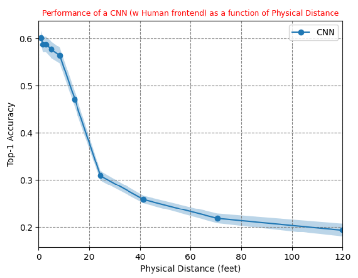

# effresdistCNN
### What is it?
A simple CNN test performance on CIFAR10 dataset as a function of physical distance using human frontend. This frontend does not include any visual processing (V1 and higher levels) and model only the optical aparatus along with local retinal processing if any. This script is designed to exemplify the findings of our recent research, which investigated the relationship between effective resolution and physical distance (depth) in humans. The resulting mapping has been formalized, modeled, and encapsulated into a Python function with preset parameters. This function serves as a scaling transformation, simulating the impact of physical distance on neuralnet's performance through available resolution, employing a human's optical frontend. Please see the related paper: 
[Distance v.s. Resolution: Neuromapping of Effective Resolution onto Physical Distance](https://www.biorxiv.org/content/10.1101/2023.08.03.551725v1)
### Main Motivation
With a validated functional connection established between viewing distance and image resolution within the human visual system, one can systematically compare human recognition performance to machine performance. This is an attempt to showcase our motivation. Such an approach not only aids in comprehending human visual capabilities at varying distances and ranges but also facilitates the development of bio-inspired neural network architectures that consider the constraints of the human optical and visual system.
### Example Result 
A test result (degraded according to the viewing distance) with an example CNN (trained on clear images) using CIFAR10 dataset. 

